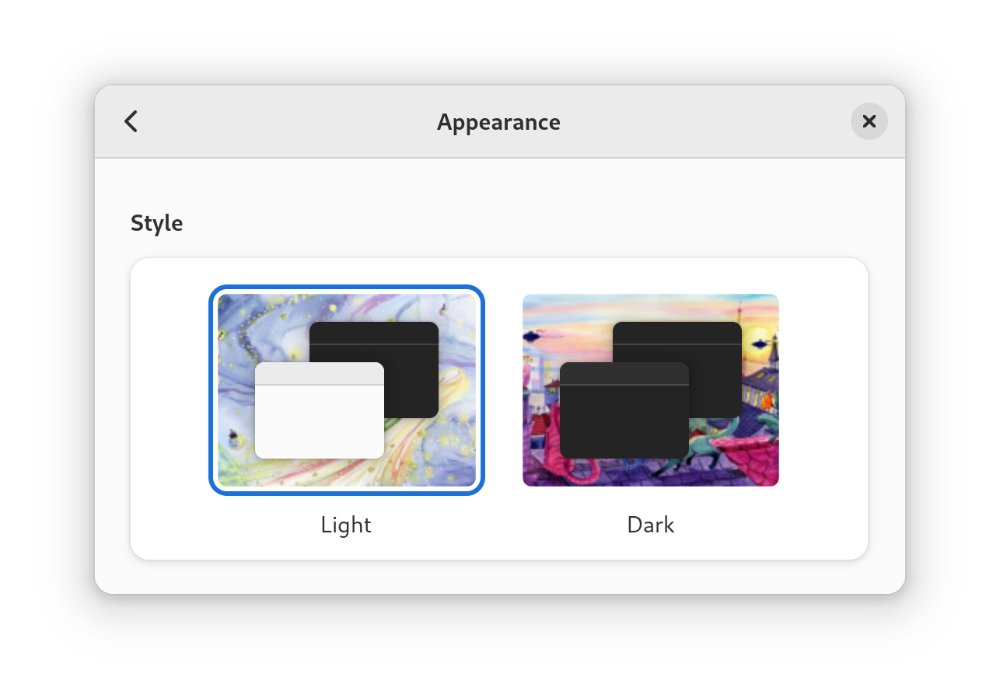
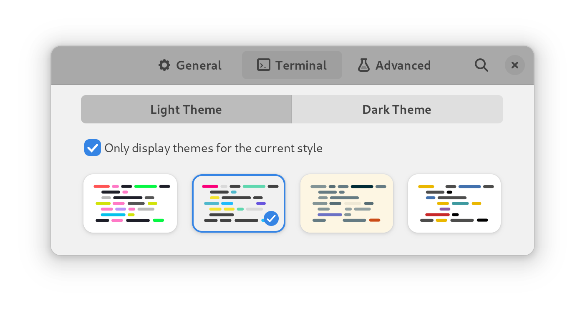
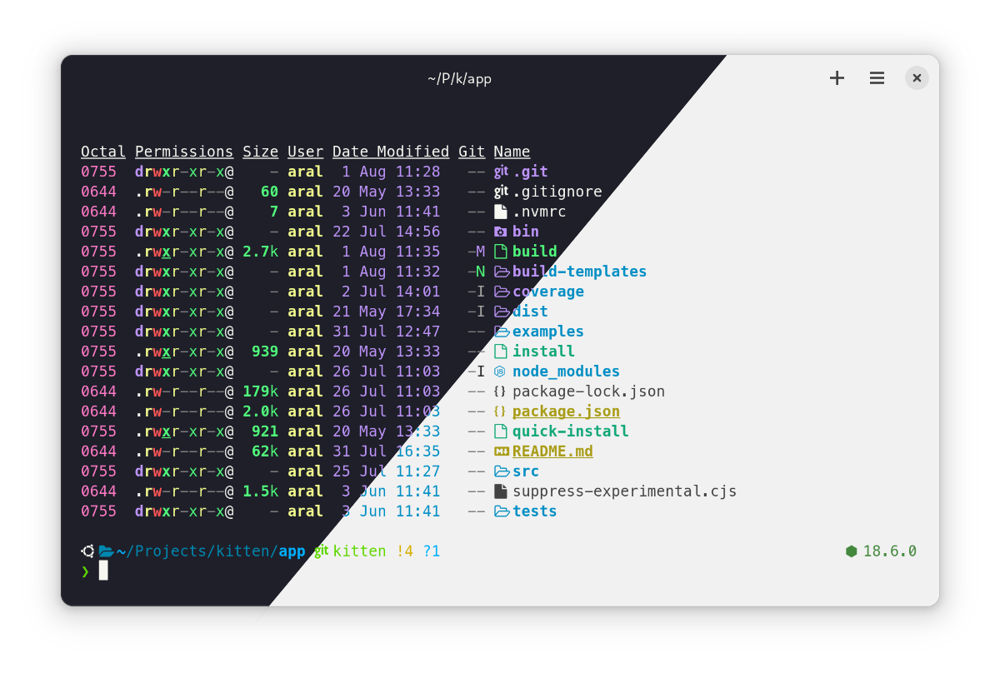
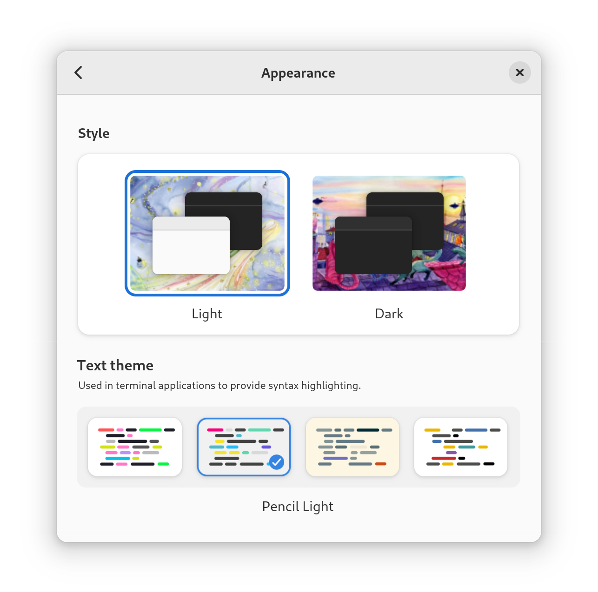

# Console Colour Scheme Synchroniser (C2S2)


## 🚧 Work in progress, please do not use yet.


Console Colour Scheme Synchroniser (C2S2) is a configurable mechanism for synchronising the themes of command-line applications with GNOME system colour scheme changes.

[Why?](#why)

## System requirements

- GNOME 42+
- A colour scheme aware Terminal application like [Black Box](https://gitlab.gnome.org/raggesilver/blackbox#black-box)
- systemd

## Install

😇 [Download and run this installation script.](https://codeberg.org/small-tech/c2s2/raw/branch/main/install) 

😈 Or, if you enjoy living dangerously, pipe it from here to your shell (ooh, naughty!)

__Using wget:__

```shell
wget -qO- https://codeberg.org/small-tech/c2s2/raw/branch/main/install | bash
```

__Using curl:__

```shell
curl -s https://codeberg.org/small-tech/c2s2/raw/branch/main/install | bash
```

## Use

The installer copies a couple of bash scripts (_c2s2-monitor_ and _c2s2-update) into your [~/.local/bin](https://specifications.freedesktop.org/basedir-spec/basedir-spec-latest.html)_ folder and sets up a systemd service to run the monitoring script. When the monitoring script detects that the system colour scheme has changed, it calls the update script.

The installer also creates two configuration files (bash scripts) in the _~/.config/c2s2_  folder:

- light
- dark

By default, c2s2 will simply log colour scheme changes to the systemd journal (which you can view using the `journalctl c2s2` to make sure it’s working).

To configure c2s2, copy the configurations from here into them.

## Configurations

Add the **Light** snippets to *~/.config/c2s2/light* and the **Dark** snippets to *~/.config/c2s2/dark* from the configurations below for the command-line apps you use.

*The snippets below include default theme recommendations. Please feel free to modify these to use any other theme supported by the app.*

### Helix Editor

[Helix Editor](https://helix-editor.com/) is a modal command-line editor inspired by [Kakoune](http://kakoune.org/) that has multiple cursors, a select-then-affect model, [tree-sitter](https://tree-sitter.github.io/tree-sitter/) integration, and [language server](https://microsoft.github.io/language-server-protocol/) support.

**Light:**

```bash
# Helix Editor
sed -i 's/theme = ".*"/theme = "onelight"/' ${HOME}/.config/helix/config.toml
```

**Dark:**

```bash
# Helix Editor
sed -i 's/theme = ".*"/theme = "dracula"/' ${HOME}/.config/helix/config.toml
```

## Bat

[Bat](https://github.com/sharkdp/bat#readme) is a *cat(1)* clone with syntax highlighting and Git integration.

**Light:**

```bash
# Bat (also used by Delta, etc.)
export BAT_THEME='Monokai Extended Light'
```

**Dark:**

```bash
# Bat (also used by Delta, etc.)
export BAT_THEME='Dracula'
```

## Delta

[Delta](https://github.com/dandavison/delta#readme) is a syntax-highlighting pager for git, diff, and grep output.

👉 Uses [Bat’s settings](#bat).

## Why?

The GNOME display environment[^1], since version 42, implements support for light and dark appearance styles (aka Colour Schemes).[^2]



With a GNOME extension like [Night Theme Switcher](), you can even automate the switch from light mode to dark mode based on time of day (or using an icon in the system bar).[^3]


Furthermore, newer terminal applications like [Black Box](https://gitlab.gnome.org/raggesilver/blackbox#black-box) follow GNOME’s colour scheme and automatically switch between light and dark themes for the console and its content.



This is all great and it means that you can, for example, have your computer switch automatically to dark mode at sunset and have your terminal adapt to it automatically.



The immediately-obvious problem, however, is that very few command-line applications adhere to the terminal theme, choosing to override it with their own theme settings, which, rarely if ever take the system colour scheme (light/dark mode) into consideration.

However, if we tackle this as a design question, exploring it from first-principles, we see that the actual problem is not at the terminal level either: it is at the desktop environment level. In other words, in GNOME.



**So the ideal solution to this design problem would be for the theme settings in a terminal app such as [Black Box](https://gitlab.gnome.org/raggesilver/blackbox#black-box) to actually exist in the Appearance settings of GNOME itself and for every app running on the system, including terminal apps, to use them when rendering syntax-highlighted text.** 

Were this to be implemented, it would mean terminal apps and command-line apps would no longer have to implement custom theme support themselves.

## The most important lesson in design

The most important lesson in design is that design does not begin with solving a problem. Design begins at understanding what problem you’re solving. Most times, bad design (unusable, overly complicated, etc.) doesn’t arise from solving a problem badly (although this can, of course, happen) but from solving the wrong problem.

The actual design problem we should be solving here is how to ensure that any app on a system that renders syntax highlighting for text does so consistently with every other app. Once we understand the problem, we also understand at what level it can be solved.

So we know, for example, that it cannot be solved at the level that C2S2 solves it. Therefore, we know that C2S2 is not a design solution. C2S2 is a hack; a pragmatic short-term workaround; a stopgap. The problem C2S2 solves is “how do we ensure command-line apps that implement their own theme systems keep them synchronised with system colour scheme settings.” This problem already has so many incorrect assumptions baked in that it cannot possible be the correct design problem to solve. Now that we know what the correct design problem is, we know, for example, that command-line apps _should not_ be implementing their own theme systems (the operating system/desktop environment should). We also know that terminal apps should not be doing this either (because, again, the operating system/desktop environment should).

We also see that by solving the right problem at the right level (or layer), we create less work for all lower levels (or layers). Were GNOME to implement system themes for syntax-highlighted text display for light and dark modes, all apps – including terminal apps and all command-line applications – could consistently adhere to them without doing anything at all. Think of all the (and thus complexity) removed from the equation.

The problem, of course, is that consistency is hard. And consistency in free/open source is even harder. We still have an uphill battle even to get a desktop environment like GNOME to itself adhere to its own colour scheme settings. Mostly because some folks like how something looks, consistency be damned. GNOME has currently even formalised this inconsistency by not just having a light and dark mode but a “mixed mode.” What’s mixed mode? Quite bluntly, it’s an example of bad design born out of a culture where design is still, to some extent (although this has gotten immeasurably better in recent years with the effect of folks like [Tobias Bernard](https://blogs.gnome.org/tbernard/)), not practised from first principles but subject to the whims and fancies of individual developers and the compromises they (often times reluctantly) reach between themselves.

It’s important to understand that this is not just about aesthetics or vanity. If someone has their system set to light or dark mode, there may well be important accessibility and usability related reasons for doing so. So beyond consistency (which itself lowers the cognitive load of the entire system), not respecting a system setting like light or dark mode is a perfect example of not respecting the people who use the tools we make. We must constantly remind ourselves that our preferences as developers do not override those of the people using the things we make.

In any case, while I hope that the solution to the correct design problem can be implemented at the correct level/layer, we must also be pragmatic. So we can implement sub-optimal workarounds at other levels.

C2S2 tackles the problem at the most pragmatic and most sub-optimal level possible: at the shell-level. It requires hacks to be implemented for individual command-line applications and thus has a potentially infinite problem space. This is literally the worst possible place to fix this problem and yet the place where it is easiest to do so without engaging in (the often times frustrating process of) getting an open source project to implement a design change.

One step up from C2S2 would be to fix the problem at the terminal app level while using the same technique C2S2 uses of light and dark mode hacks for individual CLI apps.

So a terminal app like Black Box, for example, could listen for system colour scheme changes and call the corresponding light or dark script. This would remove the need for C2S2 and reduce the problem to one of configuration (you would have to keep the light and dark scripts updated for the CLI apps you use).

Still suboptimal, but better. And this solution would only require implementation effort from terminal apps.

We can stay at the terminal app level and implement a better solution: The terminal app could set an environment variable (maybe one that’s even eventually [standardised by freedesktop.org](https://specifications.freedesktop.org/basedir-spec/latest/ar01s03.html)) like `$XDG_TERMINAL_HANDLES_THEME`. Command-line apps could, then, easily implement support for this by checking for it and, if it exists/is `true`, by disabling their own theme support to use the system theme. This solution is much better and could, eventually, lead to command-line apps not having to implement themes themselves if enough terminal apps adhere to it. This is the second-based solution, and likely the best compromise between purity and pragmatism, given how difficult it would likely be to get GNOME to implement the optimal solution.

And, to reiterate, the ideal solution would be for the operating system/desktop environment to implement a solution that can be used not just by terminal apps but in any app (e.g., graphical code editors, etc.) that displays text with syntax highlighting.

Until then (or until any of the more optimal solutions are implemented by others), I hope you’ll find C2S2 useful as a stopgap.

[^1]: Used by operating systems like Ubuntu, Fedora, etc. (Linux is confusing like that.)
[^2]: [GNOME’s implementation of colour schemes is currently not holistic.](https://gitlab.gnome.org/GNOME/gnome-shell/-/issues/5545) Which is a nice way of saying it’s inconsistent and not very well supported by interfaces within GNOME shell itself. For example, if you want to create your own custom wallpapers for light and dark mode, you have to use [GNOME Tweaks](https://wiki.gnome.org/Apps/Tweaks).
[^3]: The ability to schedule colour scheme changes based on time of day, having colour scheme changes animate smoothly, and having an easy to reach control for changing the colour scheme manually – in other words, basically everything the Night Theme Switcher extension does – are features that should really be added to GNOME itself and presented with intelligent defaults (e.g., for sunset for switching to dark mode).